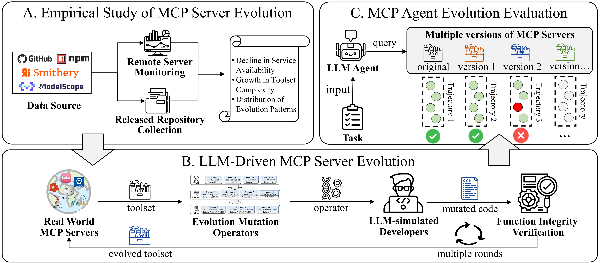

# MCPEvol-Bench

**Benchmarking LLM agents when MCP toolsets evolve across iterations.**

MCPEvol-Bench evaluates how well language-model agents **plan** and **complete tasks** when the underlying Model Context Protocol (MCP) servers change over time—mirroring real deployments where tools are added, removed, or refined.

---

## Why this benchmark?

| Focus | What we stress-test |
| :--- | :--- |
| **Dynamic tools** | Agent behavior under **iterative MCP server evolution** (early → middle → late stage toolsets). |
| **Planning vs. execution** | Separate signals for **task fulfillment** and **planning effectiveness** across stages. |
| **Stability under change** | **Evolutionary Competency Score (ECS)** summarizes robustness when comparing trajectories across evolution snapshots. |

---

## Framework

<p align="center">
  
</p>

---

## Leaderboard (main results)

Higher is better (↑). *Planning effectiveness* is abbreviated as *Planning Eff.* in column headers.

| Model | Early<br>Task ↑ | Early<br>Planning Eff. ↑ | Middle<br>Task ↑ | Middle<br>Planning Eff. ↑ | Late<br>Task ↑ | Late<br>Planning Eff. ↑ | ECS ↑ |
| :--- | :---: | :---: | :---: | :---: | :---: | :---: | :---: |
| Qwen3.5-9B | 3.38 | 4.89 | 3.21 | 4.45 | 3.41 | 4.86 | 3.20 |
| Llama-3.3-70B | 3.84 | 3.56 | 3.88 | 3.74 | 3.94 | 3.94 | 3.56 |
| Qwen3.5-27B | 4.46 | 5.57 | 4.55 | 5.97 | 4.13 | 5.12 | 3.78 |
| GPT-4o | 5.24 | 2.85 | 5.03 | 2.74 | 4.43 | 2.78 | 3.80 |
| Gemini-2.5-pro | 5.73 | 4.62 | 5.20 | 4.03 | 4.96 | 3.71 | 3.84 |
| o3 | 5.79 | 3.79 | 5.23 | 3.21 | 5.07 | 3.10 | 4.24 |
| GPT-5.1 | 6.28 | 4.35 | 5.94 | 3.43 | 5.32 | 3.50 | 4.32 |
| Gemma-4-31B-it | 5.05 | 6.67 | 5.19 | **6.69** | 5.16 | **6.68** | 4.45 |
| Claude-Sonnet-4-5-thinking | 6.40 | 6.17 | 6.13 | 5.56 | 5.72 | 4.98 | 4.52 |
| GPT-5.4 | **7.23** | 5.71 | **6.74** | 5.52 | 6.24 | 3.87 | 5.20 |
| Claude-Sonnet-4-6 | 7.22 | **6.76** | 6.61 | 6.42 | 6.18 | 6.17 | 5.22 |
| Claude-Opus-4-6 | 7.15 | 6.70 | 6.93 | 6.18 | **6.77** | 6.03 | **6.09** |

---

## Metrics (quick glossary)

- **Task fulfillment** — Did the agent achieve the user’s goal in the scenario?
- **Planning effectiveness** — Quality of the agent’s tool-use plan relative to the task (see paper / judge rubric for definitions).
- **ECS (Evolutionary Competency Score)** — Aggregates consistency of **task fulfillment** across evaluation directories aligned with different MCP evolution stages (see `src/custom/analysis/answer/evolutionary_volatility.py`).

---

## Requirements

| Component | Version (tested) |
| :--- | :--- |
| Python | 3.12.x (e.g. 3.12.12) |
| Node.js | 24.13.0 |
| npm | 11.6.2 |

- **Python dependencies:** install from the pinned list at the repository root:  
  `pip install -r requirements.txt`
- **MCP multiplexer:** install [**1mcp**](https://docs.1mcp.app/guide/quick-start) for a unified interface to multiple MCP servers ([npm quick start](https://docs.1mcp.app/guide/quick-start) · [GitHub](https://github.com/1mcp-app/agent)).

---

## Repository layout

```text
MCPEvol-Bench/
├── README.md
├── assets/
│   └── workflow.png          # framework figure
├── requriements.txt          # pinned Python dependencies (install from repo root)
├── servers/                  # MCP server bundles & 1mcp configs (original + evolved)
│   └── 1mcp_config/
└── src/
    └── custom/               # agent runs, prompts, and evaluation scripts
```

---

## Quick start

Tasks in MCPEvol-Bench/src/custom/data/test_cases/test_cases.json

### 1. Prepare MCP server bundles

Download [Evoluation Servers](https://huggingface.co/datasets/anonymous2233/evol-servers); Unpack the server archives under `servers/` (example for `iter3`; adjust names to match your archives).

```bash
cd servers
unzip -q iter3_servers.zip -d ./iter3_servers
```

On Windows, you can unpack with File Explorer or:

```powershell
Expand-Archive -Path iter3_servers.zip -DestinationPath .\iter3_servers
```

### 2. Point 1mcp configs at your machine

Edit the JSON under `servers/1mcp_config/` (e.g. `original/`, `iter3/`, `iter5/`) and replace placeholders:

| Placeholder | Replace with |
| :--- | :--- |
| `/path/to/workspace/` | Absolute path to this repository |
| `/path/to/iter3-servers` | Absolute path to the unpacked **iter3** servers directory |
| `/path/to/iter5-servers` | Absolute path to the unpacked **iter5** servers directory |

### 3. Launch MCP servers with 1mcp

First launch may take several minutes while dependencies download.

```bash
1mcp --port 3050 --log-level error --config servers/1mcp_config/original/mcp.json
```

Use the same host/port in your agent script’s `--mcp_server_url` (below).

### 4. Configure model API keys

In `src/custom/real_mcp/tool_level_test.py`, set `api_key` and `model_url` where indicated (around lines 593–594 and 651–652).

### 5. Run the agent

**Original (baseline) toolset:**

```bash
cd src
python custom/real_mcp/tool_level_test.py \
  --test_case_file custom/data/test_cases/test_cases.json \
  --model_name gpt-5.4 \
  --step 3 \
  --mcp_server_url http://127.0.0.1:3050/mcp \
  --output_path custom/data/exp_output
```

**Evolved toolset(s)** (example with hybrid mutation path):

```bash
python custom/real_mcp/tool_level_test.py \
  --test_case_file custom/data/test_cases/test_cases.json \
  --model_name gpt-5.4 \
  --step 4 \
  --mcp_server_url http://127.0.0.1:3050/mcp \
  --output_path custom/data/exp_output \
  --mutation_path custom/data/mutation/HYBRID/
```

### 6. Evaluate answers

**Task fulfillment & planning** (judge over saved trajectories).  
`--answer_path` must be a **directory** whose path contains the segment `ANSWER` (where per-case `*.json` lives); results are written alongside it by replacing `ANSWER` with `EVAL`.

```bash
cd src
python custom/analysis/answer/evaluation.py \
  --answer_path custom/data/exp_output/gpt-5.4/ANSWER
```

**Evolutionary Competency Score (ECS)** — three directories of per-task **evaluation** JSONs produced by the step above (e.g. baseline vs. two evolution stages):

```bash
python custom/analysis/answer/evolutionary_volatility.py \
  --dir_a /path/to/original_eval \
  --dir_b /path/to/evolved_eval_1 \
  --dir_c /path/to/evolved_eval_2
```

*(Paths should point to folders containing the evaluation `*.json` files produced by the evaluation step.)*

---

